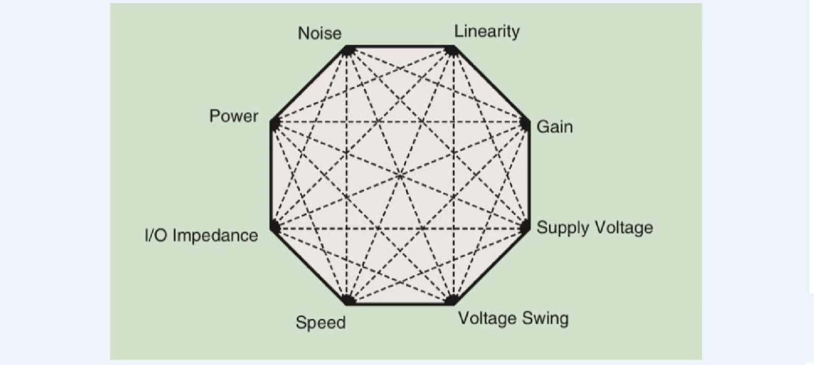
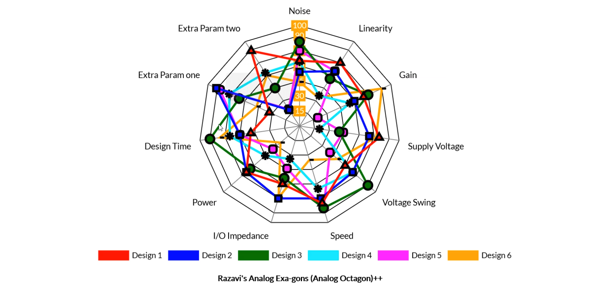
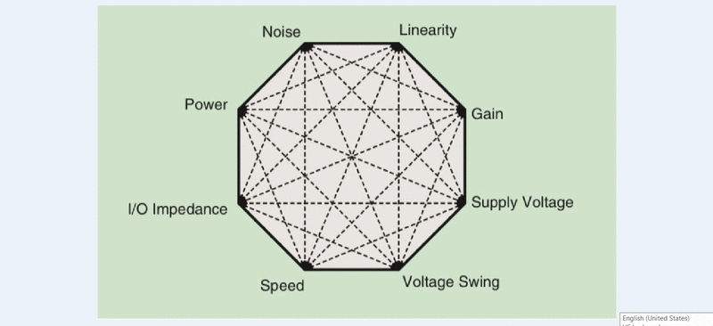

# RazXgGen

RazXgGen.py - A python package for generating Razavi's Analog Exa-gons (Analog Octagon)++ 
Radar Chart for Analog Designs Evaluation and Comparison using Chart.js

By [M. B. Ghaznavi-Ghoushchi](https://github.com/ghoushchi).
this code had been modified by [AfifehGhaemnia](https://github.com/AfifehGhaemnia)   for digital design

This repo is the official implementation of "[RazXgGen.py - A python package for generating Razavi's Analog Exa-gons (Analog Octagon)++/DigitalDesign](https://github.com/yarpose/YARPOSE.RazXgGen)".

How to:
Edit RazXgGen.py and add your own items to Json data.
Please normalize items to 0-100 before using.
7 different examples are also included for demonstration

### Run example online: [DEMO]([(https://github.io/AfifehGhaemnia/YARPOSE.RazXgGen/blob/master/html/index6.html)])

You can see the details of each point by click on it too.

